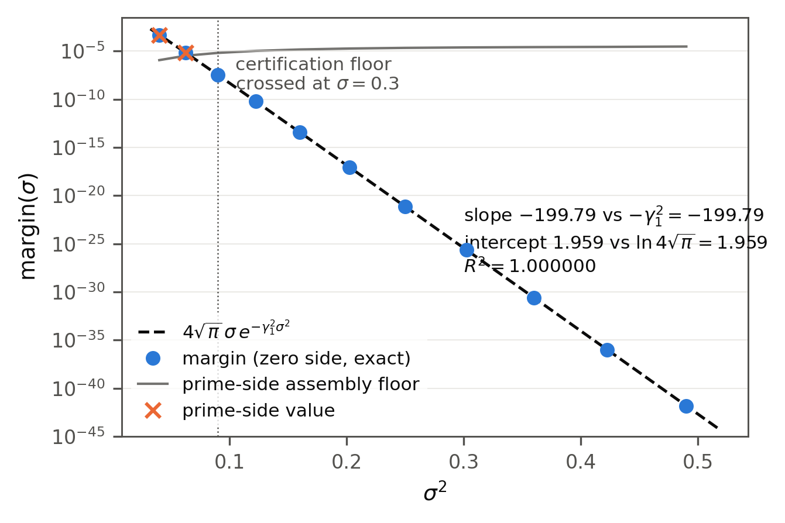
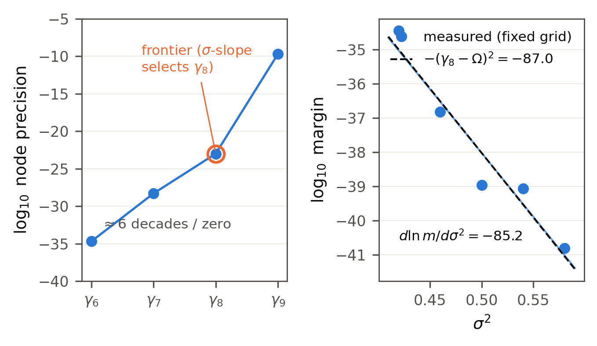
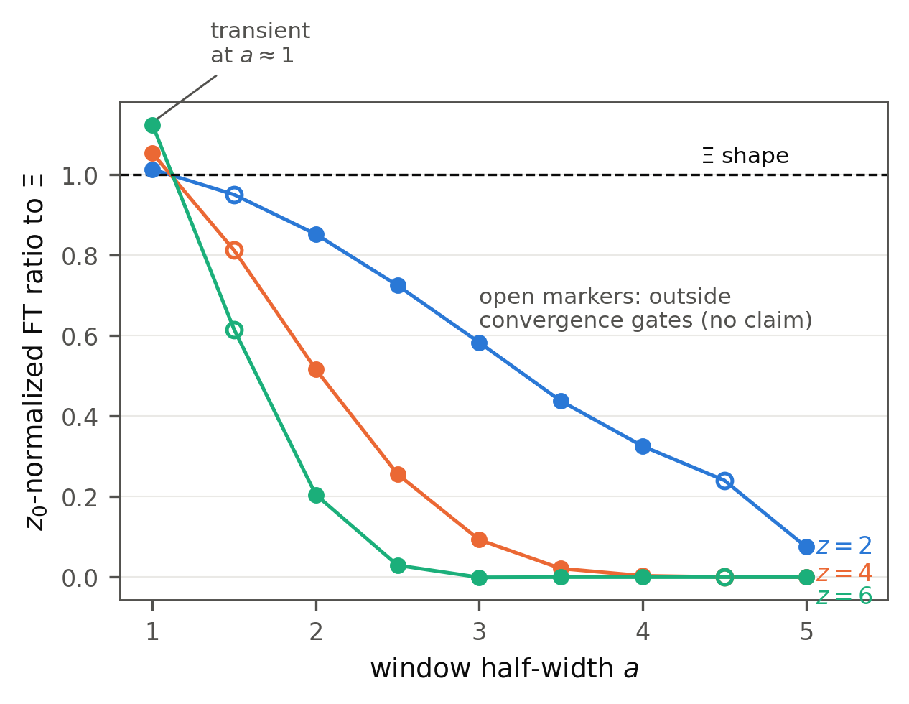
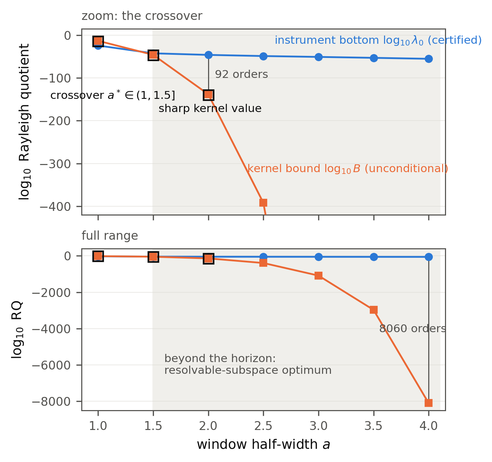

# The ground state of the localized Weil form: certified numerics for the Connes-Consani-Moscovici-Suzuki limit

**Owen Kent**

*Draft v0.3, 2026-08-25. Target: arXiv math.NT (cross-list math.CA), 6-10 pp. Registry: PUBLICATIONS.md P12. Status: full text drafted; figures F1-F4 generated (`make_figures.py`, `figures/`); length pass done (Section 8.2 and two placement paragraphs compressed). Open for Owen: author block/acknowledgments, arXiv categories, repository pointer in 8.3, courtesy-communication go/no-go.*

---

**Abstract.** We report a certified numerical study of the ground state of Weil's explicit-formula quadratic form restricted to a window $L^2(-a,a)$: the object at the center of a variational program going back to Yoshida (1992), developed by Bombieri (2000), realized operator-theoretically by Connes, Consani and Moscovici ("zeta spectral triples"), and unified by Suzuki, whose conjecture (1.2) asserts that the ground state's Fourier transform converges to $\xi(\tfrac12 + iz)$ as the window grows. We measure: a closed-form margin law for the single-mode window family (slope and intercept to four figures over 38 orders of magnitude, with a certification-cost corollary); zero-locking and a graded annihilation frontier for multi-mode families (the margin's $\sigma$-slope selects the first zero the family cannot annihilate, which sits two or more zeros past the naive frequency ceiling, at about six decades of node precision per zero); a $\xi$-shaped transient of the hard-window ground state at $a \approx 1$ followed by certified monotone narrowing through $a = 4$; and a direct measurement of the kernel-groundstate proximity that Connes, Consani and Moscovici name as the main remaining obstacle to their approach ($0.9988$ at $a = 1$, reproducing their numerics, decaying to $0.715$ at $a = 4$). The study then measures its own reach: the kernel's full-line Mellin transform vanishes exactly at every on-line zero, so its windowed form energy is tail-controlled and collapses doubly-exponentially ($\sim e^{-2\pi e^{2a}}$), undercutting the instrument's certified bottom from $a = 1.5$ on (by 92 orders of magnitude at $a = 2$, 8060 at $a = 4$). Beyond that crossover the computed minimizer is the resolvable-subspace optimum, not the continuum ground state, and the conjecture is numerically undecidable by direct minimization at any realistic precision: the horizon is priced at $\sim 2\pi e^{2a}/\ln 10$ digits. Every claim carries its precision protocol, its convergence gate, and its certificate; three of the study's own pre-registered hypotheses were refuted by its runs, and the refutations, including the one that re-scopes the study's own headline trend, are reported as the results they produced. The note claims no progress toward the Riemann Hypothesis.

---

## 0. What this note is and is not

This note claims no progress toward the Riemann Hypothesis. It measures, with explicit certificates, the finite-window behavior of an object that a live spectral-theoretic program has placed at the center of an approach to RH, and it tests, at finite scale, a specific limit conjecture about that object. All computations are unconditional: they consume zeros of $\zeta$ that are certified on the critical line (heights up to $T = 1500$ at 110 digits, computed and re-verified locally), and no statement here depends on the truth of RH. Where a measured trend bears on the conjecture, the scope of the statement (which object, which window range, which precision floor) is stated exactly; where our own pre-registered expectations failed, the failures are reported.

## 1. The object, the instrument, and the precision protocol

### 1.1 The localized Weil form

Work in logarithmic coordinates $x = \log u$. For even, real test functions $f$ supported in $[-a, a]$ define

$$Q_T(f) \;=\; 2 \sum_{0 < \gamma \le T} \big|\hat f(\gamma)\big|^2, \qquad \hat f(\gamma) = \int_{-a}^{a} f(x) \cos(\gamma x)\, dx,$$

the zero-side Gram of the Weil explicit formula, truncated at height $T$ and accompanied throughout by an a-posteriori tail bound $2\int_T^\infty |\hat f(t)|^2 \rho(t)\, dt$ with $\rho(t) = \frac{1}{2\pi}\log\frac{t}{2\pi}$ the Riemann-von Mangoldt density (Section 8.1). The zeros consumed are certified simple and on-line to the stated height, so on the space of test functions considered $Q_T$ plus its tail accounting is a faithful finite-scale version of the quadratic form whose restriction to $L^2([\lambda^{-1}, \lambda], d^*u)$, $\lambda = e^a$, is studied by Connes, Consani and Moscovici [CCM, Section 3]: their localization map $\kappa$ is a weightless isometry onto the additive picture used here (their Proposition 3.2), so the window half-width $a$ equals $\log \lambda$ and the objects match with no reweighting. The ground state at window $a$ is the minimizer of the Rayleigh quotient $Q(f)/\|f\|_{L^2}^2$ over the window space; Suzuki's account of the program [Su, conjecture (1.2), attributed there to the expectation of CCM] conjectures that suitably normalized, the ground state's Fourier transform converges to $\Xi(z) := \xi(\tfrac12 + iz)$ as $a \to \infty$.

Positivity context, for scope: Weil positivity (the full form nonnegative on the relevant test class) is equivalent to RH; the window-restricted bottom eigenvalue is strictly positive at every finite $a$ unconditionally (Yoshida), so nothing at finite window decides RH, and no claim of that kind appears below. The interest of the finite-window object is structural: it is the one place where the conjectured spectral realization of the zeros has a concrete variational candidate whose shape can be measured against $\Xi$.

### 1.2 The instruments

Two window families are used, deliberately of different rigidity.

**The soft (Gaussian) family.** Modulated Gaussians $g_\omega(x) = e^{-x^2/2\sigma^2}\cos(\omega x)$ on a frequency grid $\omega \le \Omega$. This family is analytically convenient and exposes two laws (Sections 2-3), but it is not a faithful instrument for the shape conjecture: its Rayleigh quotient rewards norm accumulation in the central spectral hole, and the resulting near-degeneracy makes the central lobe of its minimizer family-noise rather than signal (Section 4.1).

**The hard-window B-spline family.** Even cardinal B-splines of degree 12 on a uniform knot grid strictly inside $[-a, a]$: hard support by construction, thirteen orders of endpoint flatness, and exact closed forms for everything the form needs: the Fourier transforms are sinc powers times cosines, and the $L^2$ Gram is the degree-25 cardinal spline evaluated at integer offsets, a finite rational sum. No quadrature enters the quadratic form. This restores the rigidity of the hard-window operator (the within-family spectral gap $\lambda_1/\lambda_0$ stays between $8.5 \times 10^2$ and $8 \times 10^6$ across the ladder, against near-degeneracy for the soft family) and is the instrument for Sections 4-7.

### 1.3 The precision protocol

Three floors interact and each is tracked separately.

1. **Zero precision.** Margins at window scale sit far below double precision (Section 2), and floating-point-accurate zeros perturb the Gram at $10^{-16}$, which is fatal to an eigenvalue at $10^{-38}$. The protocol therefore runs high-precision arithmetic on high-precision zeros: 50-digit zeros to $T = 200$, 80-digit solves on zeros to $T = 350$, and 110-digit zeros to $T = 1500$ (1069 zeros, batch-polished and re-verified against the classical values), matched per experiment.
2. **Working precision (dps).** Bottom eigenvalues are resolvable only above the eigensolver's relative floor. One rung of this study (the refined $a = 2$ solve at 50 digits) was genuinely degenerate at the dps floor; raising to 80 digits resolved it and the failure class is documented (Section 8). A separate manifestation: the degree-25 spline Gram loses positive-definiteness to alternating-sum cancellation at 38 digits for $J \approx 190$ basis elements; solves are run at dps 80-110 accordingly.
3. **Basis convergence.** Shape claims are gated per rung by a double-knot-density control: only rungs whose pointwise Fourier-transform ratios are stable under refinement carry claims. The per-quantity discipline matters: eigenvectors converge before eigenvalues (at the converged $a = 1$ rung the shape is refinement-stable at $0.026$ while $\lambda_0$ itself still falls under refinement), so shape statements rest on eigenvector certificates (mixing bounds, refinement gates), and bottom-eigenvalue VALUES are reported as what they are: certified upper bounds within the instrument.

Three further certificates run per solve: an a-posteriori tail bound (the minimizer's own above-cutoff mass, with margins required to exceed ten times it), an eigenvector-mixing bound $\sqrt{\mathrm{tail}_0\,\mathrm{tail}_1}/(\lambda_1 - \lambda_0)$ (the omitted tail cannot rotate the ground state), and the refinement gate above. Each of the three caught at least one real artifact during the study (Section 8.2).

## 2. The single-mode margin law

**Measurement.** For the single-mode family $g_\omega$ at window scale $\sigma$, minimized over $\omega$, the margin (the Weil-form value per unit $L^2$ mass) obeys

$$\mathrm{margin}(\sigma) \;=\; 4\sqrt{\pi}\,\sigma\, e^{-\gamma_1^2 \sigma^2}\,\big(1 + O(e^{-\sigma^2(\gamma_2^2 - \gamma_1^2)})\big),$$

with $\gamma_1 = 14.134725\ldots$ the first zero ordinate. Measured over $\sigma \in [0.2, 0.7]$, i.e. over 38 orders of magnitude of margin ($4.8 \times 10^{-4}$ down to $1.5 \times 10^{-42}$): log-slope $-199.79$ against $-\gamma_1^2 = -199.79$, intercept $1.959$ against $\ln(4\sqrt\pi) = 1.959$, $R^2 = 1.000000$.

**The refuted pre-registration.** The registered expectation was that the optimal modulation dodges into the midgap, $\omega^* = \gamma_1/2$, giving exponent $(\gamma_1/2)^2 \approx 49.9$. The run refuted it: $\omega^* = 0$ at every rung. The reason is doing real work: the explicit formula cancels the pole term against the prime and archimedean terms exactly, so the pole does not penalize the unmodulated bump, the deepest spectral hole is the full central gap $(-\gamma_1, \gamma_1)$, and the margin is carried by the first zero alone. Given $\omega^* = 0$, the closed form is an elementary Gaussian integral against the zero density; the finding is $\omega^* = 0$, the hole-around-the-cancelled-pole geometry, and the price below.

**The certification-cost corollary.** The prime side assembles this exponentially small positive number out of $O(1)$ pole, archimedean and prime terms that cancel; at assembly accuracy $\varepsilon$ it certifies positivity only for $\sigma^2 < \ln(c/\varepsilon)/\gamma_1^2$. Measured: the $\sigma = 0.2$ rung is certified prime-side to $3.8 \times 10^{-7}$ agreement with the exact margin; the floor is crossed at $\sigma = 0.3$; every rung beyond is saturated. Certifying window-scale Weil positivity from the prime side costs $e^{\gamma_1^2 \sigma^2}$ in assembly precision.

**Scope and placement.** The law is the floor of a one-parameter test family: an upper bound on the full-space infimum where the RH-equivalent statement lives, and a coordinate system, not a positivity theorem. Its mechanism is elementary once $\omega^* = 0$ is known; the value here is the measured-then-derived calibration (four figures over 38 orders) and the certification-cost reading. A targeted pass over the Fourier-optimization school (Beurling-Selberg extremal problems, Gaussian subordination, reproducing-kernel bounds on low-lying zeros, and the 2026 numerical cluster on the truncated arithmetic-side form) found no statement of this closed form, of a Gaussian-width margin law for the zero-side form, or of the $\gamma_1^2$ rate. The nearest in-print relative, which related work must cite, is Connes [C26, Section 6.4]: a closed-form decay law $1 - \chi_2 \sim \frac{2^{14}}{3}\sqrt{2\pi^5}\, e^{-4\pi e^L} L^{9/2}$ for the smallest eigenvalue of the ARITHMETIC-side truncated form, exp-of-exp in the window length $L$ by the prolate phase-space mechanism: same genre, different object, different variable ($L$, not $\sigma$), different mechanism (no $\gamma_1$ appears). Groskin's tail-budget theorem for the arithmetic-side truncation [G26b, Thm 3.2] is the $T$-direction cousin of the certification-cost corollary above.

## 3. Multi-mode bottoms: zero-locking and the graded annihilation frontier

**Locking, placed.** With $J$ modulated modes reaching past the low zeros, the minimizer places a spectral node on every zero its frequency band reaches, exactly at working precision: node-on-zero to $10^{-38}$-$10^{-41}$ at 50 digits, at every window scale tested. (An earlier grid-limited readout of $4 \times 10^{-3}$ was resolution, not physics; the refined instrument pinned it.) Surplus degrees of freedom park inside the central hole where the form cannot charge them. Node-on-zero recovery from ground states of the SIBLING object, the arithmetic-side truncated Weil form, is by now well documented in print and at greater depth than our working precision: Connes' fifty-zero table at prime cutoff 13 [C26, Section 5], the CCM Section-6 datum, and Groskin's independent implementation recovering $\gamma_1, \ldots, \gamma_{10}$ to 307-329 digits [G26a]; the criticality theorem behind all of it (finite-truncation ground states have real Fourier-Mellin zeros) is Connes-van Suijlekom. What this section adds is not the phenomenon but its zero-side face with the structure the arithmetic-side measurements do not resolve: the exactness typing (interpolate-vanish on the reachable spectrum, spend the leftover freedom in the hole: the anatomy of the form's near-failure directions) and the frontier law below.

**The refuted nearest-gap law and the frontier law that replaced it.** The registered expectation for the multi-mode margin was a nearest-gap law (margin governed by the gap to the nearest unreachable zero). The run killed it: same-gap rungs differ by 1.5 decades, and the margin RISES monotonically with the frequency ceiling $\Omega$ (a density-edge effect), while the gap-squared regressor is $\sigma$-blind. The law that replaced it, mechanism-checked at 2 percent: with the mode grid fixed,

$$\frac{d \ln \mathrm{margin}}{d(\sigma^2)} \;=\; -(\gamma_{\mathrm{frontier}} - \Omega)^2,$$

where $\gamma_{\mathrm{frontier}}$ is the first zero the family cannot annihilate (measured slope $-85.2$ against $-(\gamma_8 - \Omega)^2 = -87.0$ in the reference configuration). The frontier sits two or more zeros PAST the nominal ceiling $\Omega$ (spare dimensions annihilate $\gamma_6, \gamma_7$ above the band), and it is graded: node precision degrades geometrically across it, $2 \times 10^{-35} \to 5 \times 10^{-29} \to 1 \times 10^{-23} \to 2 \times 10^{-10}$ across $\gamma_6, \ldots, \gamma_9$, about six decades per zero.

**Unified reading.** Both margin laws are one statement at different capacities: the window margin is a single-zero Gaussian leak at the family's annihilation-capacity edge. The single-mode family pays $\gamma_1$; a $J$-mode family pays $\gamma_{\mathrm{frontier}}(J)$. An instrument lesson with teeth: the naive $\sigma$-sweep (letting mode count vary with $\sigma$) has the OPPOSITE sign of the physical derivative ($+25$ versus $-85$: growing capacity deepens annihilation faster than the Gaussian narrows); one earlier two-point retrodiction that ignored this is downgraded to coincidence in the record.

**Placement of the frontier law.** The targeted pass found no prior statement of the $\sigma$-slope selection rule, the two-plus-zero overshoot, or a per-zero geometric precision cost for zeta zeros. The structural relatives, each short of the law: superoscillation energy costs (oscillation past a band ceiling at exponential price: the overshoot's qualitative twin, never applied to zeta zeros); the Fourier-uniqueness capacity accounting (Kulikov's density inequality; the Bondarenko-Radchenko-Seip interpolation basis as the infinite-capacity endpoint); complementary-slackness root placement in the LP/sign-uncertainty school. Connes' fifty-zero error table is itself a graded profile (roughly a decade per zero at cutoff 13), reported as data with no rate statement and no selection rule.

## 4. The $\xi$-shape transient

### 4.1 Why the soft family cannot see the conjecture

Tested directly against $\Xi$, the soft-family minimizer's central shape fails at every scale ($L^2$ residual 33-154, fitted scale sign-unstable), and the mechanism is visible in the spectrum of the form: the Rayleigh quotient rewards norm-stuffing in the central hole, so the central lobe is nearly-degenerate noise. This is a statement about the family, not the conjecture; it types the instrument requirement (hard support, operator rigidity) that the B-spline family supplies. The split is informative for where the conjecture's content lives: zero-locking is family-robust; the central lobe is family-fragile.

### 4.2 The hard-window ladder: through $\Xi$ at $a \approx 1$, then below it

With the hard-window instrument at the basis-converged rung $a = 1$:

- the ground state's Fourier transform matches a fitted multiple of $\Xi$ on $[0, 10]$ with $L^2$ residual $0.051$, pointwise within 26 percent out to $z = 8$, refinement-stable to $0.026$: a factor $\sim 10^3$ better than the soft family, and the first positive numerical contact with the conjectured shape in this study;
- node locking at $\gamma_1$ persists at $10^{-18}$-$10^{-28}$.

Continuing the ladder at matched certificates (80-digit solves, zeros to $T = 350$, per-rung refinement gates): the $a = 2.0$ rung is certified converged (gate shift $0.006$, healthy gap after the 50-digit degeneracy was diagnosed as precision starvation), and its ground state's FT sits at a FIFTH of $\Xi$'s relative mass at $z = 6$ ($z_0$-normalized ratio $+0.20$, against $+1.12$ at $a = 1$). The finite-$a$ computed ground state passes THROUGH the $\xi$ shape near $a = 1$ and narrows strictly below it. (Section 7.4 will bound what this trend can say about the continuum object: the $a = 1$ rung sits below the study's measured resolution horizon and the $a \ge 1.5$ rungs above it.)

## 5. Placement: which object the conjecture is about

Reading the sources at depth resolved an identification question the literature had not posed explicitly, and one naive reconciliation was built and refuted on the way.

**The three objects.** (a) The UNCONSTRAINED window bottom (the minimizer over all of $L^2(-a,a)$): the object measured above. (b) The POLE-CONSTRAINED bottom (minimization within CCM's Section-7 approximant space, whose members carry a vanishing-integral condition). (c) CCM's explicit kernel $k_\lambda$, which lives in the constrained space and whose Fourier transform provably converges to $\Xi$ uniformly on closed substrips of the open strip $|\Im z| < 1/2$ (their Lemma 7.3).

**The identification.** CCM define $QW_\lambda$ as the restriction of the Weil form to the FULL window $L^2([\lambda^{-1},\lambda], d^*u)$, with a weightless localization isometry (their Section 3.1 and Proposition 3.2); the vanishing-integral condition lives only in their Section-7 kernel construction, not in the variational problem defining the ground state. So conjecture (1.2)'s object IS the unconstrained bottom, and the measurements of Section 4 bear on it directly.

**The refuted reconciliation, and a boundary fact.** The candidate explanation for the narrowing (that the pole constraint was wrongly omitted) was tested by exact projection (constraint residuals $10^{-81}$): imposing it does NOT restore the $\xi$ shape: the constrained bottom's $z_0$-normalized ratios explode (17-319) and no rung passes the convergence gate at matched resolution. The structural reason is an mp-verified boundary fact: $\Xi(i/2) = \xi(0) = 1/2 \neq 0$: THE XI FUNCTION ITSELF VIOLATES THE POLE CONSTRAINT. The conjectured limit lives outside the constrained space; CCM's kernel convergence is interior-only, with the boundary pinch squeezed off every compact substrip as $\lambda \to \infty$. At small windows the pinch contaminates the accessible real axis, which is exactly the exploded-ratio phenomenology of the constrained control.

**Consistency with CCM's evidence.** Their numerical proximity plots live at $\mu = \lambda^2 \le 36$, i.e. $a \le 1.79$, where all measurements here agree with theirs (Section 7).

## 6. The turnaround hunt: certified no-turnaround through $a = 4$

If (1.2) holds for the unconstrained object, the narrowing of Section 4 must reverse at some window $a^*$. The hunt was run at the measured requirements: 1069 zeros to $T = 1500$ at 110 digits, dps-110 solves to $J = 274$ basis elements, per-rung gates.

**Verdict: no turnaround anywhere in $a = 2.5$ to $5.0$.** The $z_0$-normalized ratio at $z = 6$ is pinned at zero from $a = 3$; at $z = 4$ it is dead by $a = 4$; at $z = 2$ it falls to $0.075$ by $a = 5$. The collapse is CERTIFIED through $a = 4$ ($\lambda \approx 55$): refinement gates $0.006$-$0.040$, mixing bounds $2 \times 10^{-11}$ to $4 \times 10^{-5}$; the $a = 4.5$ and $a = 5$ rungs are recorded but sit outside their gates (basis gate $0.134$; mixing $\sim 1$) and carry no claim.

**Three cross-validations inside the run.** The tail arithmetic predicted its own certificate cures twice (the $a = 2.5$ mixing failure at $T = 350$, cured to $9 \times 10^{-5}$ at $T = 600$ exactly as computed; the ladder through $a = 4$ cleaned at $T = 1500$ on schedule); the shape ratios are bit-stable across the $T = 600 \to 1500$ zero-depth change on every rung; the bottom-eigenvalue upper bounds fall smoothly ($10^{-48.7}$ to $10^{-60.3}$ across $a = 2.5..5$) with healthy spectral gaps.

**What this does and does not say.** Within the instrument's certified range, the resolvable object's approach to the conjectured limit does not turn around. At face value, combined with CCM's PROVEN kernel limit, the two statements could coexist only if the kernel-groundstate proximity degrades at larger windows; that reading has an unstated third branch (the instrument no longer tracks the continuum ground state), and Section 7 shows by an energy measurement that the third branch is the one that fires, at $a^* \in (1, 1.5]$. The collapse reported here is therefore a certified statement about the resolvable-subspace optimum: a well-defined, dps-robust, refinement-stable object: and its bearing on the continuum conjecture is bounded by the horizon quantified in Section 7.4.

## 7. The proximity resolution, the energy of the $\Xi$-state, and the instrument's horizon

### 7.1 The kernel is exactly $\Xi$, immediately

CCM's Section-7 kernel, built from their own equations ((7.5)-(7.6)) with the Fourier-self-dual Hermite-limit seed, $k_\lambda = E(h)$, $h = \psi_0 - \alpha\psi_4$, $E(f)(u) = u^{1/2}\sum_{n \ge 1} f(nu)$, satisfies $\hat k_\lambda/(c\,\Xi) = 1.000000$ at every test point and every window $a = 1, \ldots, 4$: their Lemma 7.3 is exact-at-scale in this construction, with no finite-$\lambda$ transient. The mechanism is exact: $\alpha = 2\sqrt6/3$ in closed form (because $\int \psi_n = \psi_n(0)$ for a self-dual $\psi_n$ of eigenvalue $+1$, the vanishing-integral condition IS $h(0) = 0$), so $k$ is exactly even in log coordinates by Poisson summation (defect $\le 10^{-45}$ verified) and the full Mellin mass is captured at $a = 1$ already. There is no slow kernel limit for the conjecture to hide behind. (The Hermite-for-prolate substitution carries CCM's own Lemma 7.2 bound $c\lambda^{-2}$, negligible from $a = 2.5$; nothing below depends on the kernel being exactly theirs: it is used as an explicit admissible trial state.)

### 7.2 The proximity measurement

The kernel-groundstate proximity (the step CCM name "the main remaining obstacle to our approach to RH"), measured against the instrument's ground state $\xi_a$: $|\cos(k_\lambda, \xi_a)| = 0.9988$ at $a = 1$ (inside their $\lambda \le 6$ evidence range: their numerics reproduced), then $0.988, 0.939, 0.876, 0.813, 0.757, 0.715$ through $a = 4$, monotone (float measurement, revalidated to four decimals by an mp projection). At face value this reconciles Sections 4 and 6 with their proven kernel limit: the proximity itself decays. The energy measurement below shows what the face value misses.

### 7.3 The energy of the $\Xi$-state: a real premium at $a = 1$, then a certified crossover

The kernel's full-line Mellin transform factors as $\hat k_{\mathrm{full}}(z) = \zeta(\tfrac12 - iz)\,\tilde h(\tfrac12 - iz)$ (absolute convergence for $\Re s > 1$; the two-sided decay makes the transform entire; continuation gives the line), so it VANISHES EXACTLY at every on-line zero: the windowed kernel's form energy is controlled by the window-truncation tails alone, quantities with no cancellation, computable at any precision. The identity was verified numerically before use: at $a = 1$ the direct oscillatory window integral equals minus the tail transform to relative deviation $10^{-73}$ at $\gamma_1, \gamma_2, \gamma_{10}$.

Two consequences, measured (certified bound $B(a)$ on the kernel's true window Rayleigh quotient, sharp values where cancellation permits; instrument bottom $\lambda_0(a)$ from dps-80 solves that match the dps-110 ladder of Section 6 to the displayed digit):

| $a$ | 1.0 | 1.5 | 2.0 | 2.5 | 3.0 | 3.5 | 4.0 |
|---|---|---|---|---|---|---|---|
| $\log_{10} \lambda_0$ | $-24.1$ | $-42.3$ | $-46.0$ | $-48.7$ | $-50.7$ | $-52.9$ | $-55.2$ |
| $\log_{10} B$ (kernel) | $-13.1$ | $-45.9$ | $-138.2$ | $-392.1$ | $-1085.8$ | $-2975.2$ | $-8114.9$ |
| $\log_{10}$ sharp | $-14.0$ | $-46.9$ | $-139.5$ | | | | |

**At $a = 1$** the $\Xi$-state pays a real premium: ten orders above the bottom. Since the $a = 1$ ground state is $\Xi$-shaped to 5 percent (Section 4), a 5-percent $L^2$ shape deviation buys ten orders of energy: at these depths, shape convergence and energy ordering are nearly decoupled coordinates, which any selection principle for the limit conjecture has to respect.

**From $a = 1.5$ on** the pincer inverts: the kernel's true window energy undercuts the instrument's certified bottom by 4 orders at $a = 1.5$, 92 at $a = 2$, 8060 at $a = 4$. Since the kernel is an admissible trial state, the CONTINUUM window bottom satisfies $\lambda_0^{\mathrm{cont}}(a) \le B(a)$: beyond a crossover $a^* \in (1, 1.5]$, the instrument (and, as argued below, any realistic instrument) provably no longer tracks the continuum ground state.

### 7.4 The horizon, and what it re-scopes

$\log_{10} B(a)$ tracks $-2\pi e^{2a}/\ln 10$ up to a slowly growing polynomial offset; the tail integral matches the analytic scale $e^{-\pi e^{2a}}$ to the leading digit at all seven rungs. The price of resolving the continuum valley at window $a$ is therefore $\sim 2\pi e^{2a}/\ln 10$ digits of working precision AND a basis whose approximation floor matches: $\sim 140$ digits at $a = 2$, $\sim 1100$ at $a = 3$, $\sim 8100$ at $a = 4$. Conjecture (1.2) is numerically undecidable by direct minimization beyond $a \approx 1.5$-$2$ at any realistic precision.

This re-scopes the note's own headline trend, and we state the correction as prominently as the trend. The certified narrowing of Sections 4 and 6 is a real, reproducible statement about the RESOLVABLE-SUBSPACE optimum: the deepest state expressible at the stated basis and precision, a well-defined object that is dps-robust (80 and 110 digits agree) and refinement-stable under the gates. It is NOT a statement about the continuum ground state beyond $a^*$, because the continuum valley is doubly-exponentially deeper than every floor in play. In particular: nothing measured here contradicts the CCM expectation about their operator's actual ground state; their kernel is variationally excellent (doubly-exponentially near-null); and the proximity decay of Section 7.2 is a statement about the resolvable optimum, with everything in agreement at $a = 1$ where the instrument still sees the continuum.

The same lens re-reads the sibling numerics: CCM's proximity evidence ($\lambda \le 6$, $a \le 1.79$) straddles the horizon ($B \sim 10^{-88}$ at its edge), and on the arithmetic side Groskin's measured $\lambda_{\min} \approx 10^{-334}$ sits some 200 orders above his own extrapolation and Connes' Section-6.4 law [G26a, C26]: the same crossover's two in-print faces. The zero-side horizon here appears to be the first certified instance: the kernel is an explicit witness and the bound is unconditional.

**The closing statement.** The window ground state of the Weil form is $\Xi$-shaped where instruments can see the continuum ($a \lesssim 1$, at a measured ten-order energy premium for the exact $\Xi$ shape), and beyond that the conjecture's object recedes behind a doubly-exponential horizon that this note prices. What direct numerics can still decide about (1.2) is exhausted by the accessible strip; progress beyond it belongs to the analytic route, for which the exact-vanishing identity of Section 7.3, elementary as it is, is the working prototype: it is the one tool here that sees the bottom of the valley at every window.

## 8. The instrument appendix: certificates and what each caught

### 8.1 The certificate suite

Per solve: (i) exact-form construction (closed-form FTs and Grams; no quadrature in the form); (ii) a-posteriori tail bound on the minimizer's own above-cutoff zero mass, with margins required to exceed $10\times$ it or be reported as bounds; (iii) eigenvector-mixing bound $\sqrt{\mathrm{tail}_0\,\mathrm{tail}_1}/(\lambda_1-\lambda_0)$; (iv) double-knot-density refinement gate on pointwise FT ratios, per rung; (v) precision-starvation screening (cross-dps reproduction of shapes; PD-failure detection in the Gram Cholesky).

### 8.2 What each certificate caught (its own artifact)

- **Capacity scaling:** a fixed-$J$ ladder's rising residual was pure capacity artifact; fixed by tying knot count to window width.
- **Cutoff exploitation:** the $a = 3$, $T = 200$ rung was excluded by its own tail certificate (tail $10^{-15}$ against a floor-level margin).
- **Precision starvation:** the $a = 2$ solve at 50 digits was genuinely degenerate (gap $0.9$); 80 digits resolved it (gap $2080$). Separately, the degree-25 Gram loses positive-definiteness at 38 digits ($J = 189$).
- **Basis-convergence gating:** first-run $a = 2$ ratios shifted by up to $20.9$ under knot doubling; all $a \ge 1.5$ shape claims were gated out until the deep protocol passed them.
- **Solver null cones (soft family):** beyond $\sigma \approx 0.45$ a double-precision generalized eigensolve returns an arbitrary null-cone member; caught by its own grid-oscillation diagnostic, fixed by the Section 1.3 protocol.
- **Boundary-fact check:** $\Xi(i/2) = 1/2$ (mp-verified) turned the constrained-control explosion into a structural statement.
- **Projection-floor typing:** within-basis kernel quotients are floor-typed at every rung (edge layer at $a = 1$; interior approximation floor beyond), so the honest kernel energies are the tail-identity values.
- **Identity-before-use:** the exact-vanishing identity was verified (direct integral against the tail route, $10^{-73}$) before any bound built on it was cited.

### 8.3 Reproducibility

All code, dossiers, and the 50/80/110-digit zero caches live in the public repository `https://github.com/owenpkent/zeta-function`; each experiment is a standalone module with its checks (`e2an`, `e2ao`, `e2aq`, `e2ar`, `e2as`, `e2at`, `e2au`, `e2av`, `e2aw`), and every headline number above is reproduced by a tracked `.npz` artifact next to its script. The figures are generated by `publications/weil_ground_state/make_figures.py` from those artifacts.

## Figures (generated: `make_figures.py`; PDF for LaTeX and PNG preview in `figures/`)

**F1 (Section 2).** The single-mode margin law over 38 orders of magnitude: exact zero-side margins (points) against $4\sqrt{\pi}\,\sigma\,e^{-\gamma_1^2\sigma^2}$ (dashed), with the prime-side assembly floor and the certification crossing at $\sigma = 0.3$. Data: `e2ao_scaling_ladder.npz`.

**F2 (Section 3).** The graded annihilation frontier. Left: node precision across $\gamma_6..\gamma_9$ (about six decades per zero; the $\sigma$-slope selects $\gamma_8$). Right: the fixed-grid margin slope, measured $-85.2$ against $-(\gamma_8-\Omega)^2 = -87.0$. Data: `e2aq_xi_convergence.npz`; per-zero profile from the reference configuration.

**F3 (Sections 4, 6).** The hard-window ladder: $z_0$-normalized Fourier-transform ratios to $\Xi$ at $z = 2, 4, 6$ across $a = 1..5$: the transient at $a \approx 1$, then the certified monotone narrowing. Open markers: rungs outside their convergence gates (recorded, no claim). Data: `e2as_deep_xi_ladder.npz`, `e2au_turnaround_ladder.npz`.

**F4 (Section 7).** The horizon. Top (zoom): the instrument's certified bottom $\lambda_0(a)$, the kernel's unconditional bound $B(a)$, sharp values where cancellation permits, and the crossover $a^* \in (1, 1.5]$ (92 orders at $a = 2$). Bottom (full range): the doubly-exponential plunge (8060 orders at $a = 4$); beyond the crossover the computed minimizer is the resolvable-subspace optimum. Data: `e2aw_energy_gap.npz`.

## Acknowledgments

This note measures objects introduced and developed by A. Connes, C. Consani, H. Moscovici, and M. Suzuki, and engages numerical work of A. Groskin; the author thanks them for making their programs and data available in print. The numerical experiments and the drafting of this note were carried out with substantial assistance from Claude (Anthropic), operated by the author; the author designed the study, verified the results, and is solely responsible for the content.

## References

- [Y] H. Yoshida, On hermitian forms attached to zeta functions, in *Zeta Functions in Geometry*, Adv. Stud. Pure Math. 21 (1992). (The localization program: the Rayleigh quotient on window spaces, small-window positivity, RH as non-degeneracy on the completion. Held via the accounts in [B] and [Su]; flagged per citation discipline.)
- [B] E. Bombieri, Remarks on Weil's quadratic functional in the theory of prime numbers, I, Rend. Mat. Acc. Lincei, s. 9, v. 11 (2000). (Attainment of the window minimum; the negative-eigenvalue count equals half the off-line zeros at sufficient truncation.)
- [CC] A. Connes, C. Consani, Weil positivity and trace formula, the archimedean place, Selecta Math. (2021); arXiv:2006.13771. (The operator-theoretic turn of the program.)
- [CCM] A. Connes, C. Consani, H. Moscovici, Zeta spectral triples, arXiv:2511.22755. (The localized form $QW_\lambda$, the Section-7 kernel $k_\lambda$, Lemma 7.3 interior convergence $\hat k_\lambda \to \Xi$, the kernel-groundstate proximity numerics at $\lambda \le 6$, and the sentence naming that step the main remaining obstacle.)
- [CvS] A. Connes, W. D. van Suijlekom, arXiv:2511.23257; Comm. Math. Phys. (2025). (Criticality of finite-truncation ground states: real Fourier-Mellin zeros at every finite cutoff.)
- [Su] M. Suzuki, Weil's quadratic form via the screw function, arXiv:2606.09096 (v2, 2026-08-18). (The unification; conjecture (1.2), attributed there to the CCM expectation; his own numerics support his (1.12).)
- [C26] A. Connes, The Riemann Hypothesis: past, present and a letter through time, arXiv:2602.04022 (2026). (Section 5: the fifty-zero recovery table at prime cutoff 13; Section 6.4: the exp-of-exp prolate decay law for the arithmetic-side smallest eigenvalue.)
- [G26a] Groskin, High-precision approximation of Riemann zeros via the truncated Weil form, arXiv:2605.20224 (v4, 2026-08). (Independent arithmetic-side implementation; $\gamma_1..\gamma_{10}$ to 307-329 digits at $c = 100$.)
- [G26b] Groskin, A finite Guinand-Weil dictionary and archimedean tail order for the truncated Weil quadratic form, arXiv:2607.02828 (v3, 2026-08). (Exact transport theorem; the archimedean tail budget: the $T$-direction certification-cost cousin.)
- [BRS] A. Bondarenko, D. Radchenko, K. Seip, Fourier interpolation with zeros of zeta and L-functions, Constr. Approx. 57 (2023) 405-461; arXiv:2005.02996. (The infinite-capacity interpolation endpoint; uniqueness breaks if one node is removed.)
- [K] A. Kulikov, Fourier interpolation and time-frequency localization, J. Fourier Anal. Appl. 27 (2021); arXiv:2005.12836. (The density inequality: the capacity accounting the frontier saturates in the large.)
- [CLV] E. Carneiro, F. Littmann, J. D. Vaaler, Gaussian subordination for the Beurling-Selberg extremal problem, Trans. Amer. Math. Soc. 365 (2013) 3493-3534; arXiv:1008.4969. (The school's Gaussian machinery: Gaussians as extremal targets, not margin probes.)
- [CCMil] E. Carneiro, A. Chirre, M. B. Milinovich, Hilbert spaces and low-lying zeros of L-functions, Adv. Math. 410 (2022); arXiv:2109.10844. (Reproducing-kernel bounds: the school's closest quantity to a band-limited form minimum.)
- [Bob+] J. Bober, J. B. Conrey, D. W. Farmer, A. Fujii, S. Koutsoliotas, S. Lemurell, M. Rubinstein, H. Yoshida, The highest lowest zero of general L-functions, J. Number Theory 147 (2015); arXiv:1211.5996. (The central hole of radius $\approx \gamma_1$ as an extremal mechanism.)

Evidence trail: the law-novelty pass with its full search log is tracked at `publications/weil_ground_state/_evidence/law_novelty_pass.md`; the prior-art sweep at `docs/03_research/reading_notes/weil_positivity_prior_art_sweep.md`.
